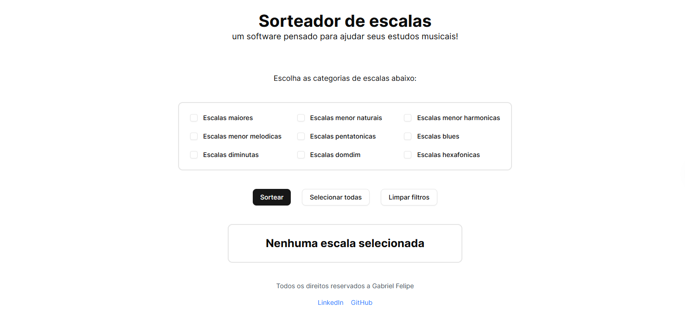

<!-- Improved compatibility of back to top link: See: https://github.com/othneildrew/Best-README-Template/pull/73 -->

<!--
*** Thanks for checking out the Best-README-Template. If you have a suggestion
*** that would make this better, please fork the repo and create a pull request
*** or simply open an issue with the tag "enhancement".
*** Don't forget to give the project a star!
*** Thanks again! Now go create something AMAZING! :D
-->

<!-- PROJECT SHIELDS -->
<!--
*** I'm using markdown "reference style" links for readability.
*** Reference links are enclosed in brackets [ ] instead of parentheses ( ).
*** See the bottom of this document for the declaration of the reference variables
*** for contributors-url, forks-url, etc. This is an optional, concise syntax you may use.
*** https://www.markdownguide.org/basic-syntax/#reference-style-links

[![Contributors][contributors-shield]][contributors-url]
[![Forks][forks-shield]][forks-url]
[![Stargazers][stars-shield]][stars-url]
[![Issues][issues-shield]][issues-url]
[![Unlicense License][license-shield]][license-url]
[![LinkedIn][linkedin-shield]][linkedin-url]
-->

<!-- PROJECT LOGO -->
 

  
  
  

  <h3 align="center">Sorteador de escalas</h3>

  

    Um sorteador de escalas para ajudar músicos a estudarem téncnica e improvisação
     
    <!--<a href="https://github.com/othneildrew/Best-README-Template"><strong>Explore the docs »</strong></a> -->
     
     
    <a href="https://sorteador-de-escalas.vercel.app/" target="_blank">Acessar site</a>
    &middot;
    <a href="https://github.com/gabrielfelipedy/sorteador_de_escalas/issues/new">Reportar Bug</a>
    &middot;
    <a href="https://github.com/gabrielfelipedy/sorteador_de_escalas/issues/new">Pedir nova funcionalidade</a>
  

<!-- ABOUT THE PROJECT -->
## Sobre o projeto

<!-- [![Product Name Screen Shot][product-screenshot]](https://example.com) -->

A ideia no projeto nasceu de uma masterclass do professor de música Nelson Faria, em que ele falava sobre uma metodologia para estudar escalas no braço todo do instrumento. Ele dizia que um ótimo método para dominar as escalas em todo o braço do instrumento em um curto período de tempo era sortear escalas de forma aleatória e escolher uma região fixa do instrumento para praticá-las.

(<a href="#readme-top">Voltar ao topo</a>)

### Feito com

[![Next][Next.js]][Next-url]

(<a href="#readme-top">Voltar ao topo</a>)

<!-- ROADMAP -->
## Roadmap

- [ ] Adicionar Changelog
- [ ] Adicionar opção "Não repetir escalas"
- [ ] Adicionar visualização de partituras, tablaturas e braço dos instrumentos
- [ ] Adicionar metrônomo
- [ ] Suporte a vários Idiomas

(<a href="#readme-top">Voltar ao topo</a>)

<!-- CONTRIBUTING -->
## Contribuindo

Para contribui com o projeto, siga o passo a passo abaixo:

1. Faça um fork do projeto
2. Crie uma branch com o nome da sua feature (`git checkout -b feature/AmazingFeature`)
3. Commite suas mudanças (`git commit -m 'Add some AmazingFeature'`)
4. Push para a sua branch (`git push origin feature/AmazingFeature`)
5. Abra um pull request

<!-- LICENSE 
## License

Distributed under the Unlicense License. See `LICENSE.txt` for more information.

(<a href="#readme-top">Voltar ao topo</a>)

-->

<!-- CONTACT -->
## Contact

Gabriel Felipe Assunção de Souza - [@gabrielfelipedy](https://linkedin.com/in/gabrielfelipedy) - gabriel.felipe.dy@gmail.com

Link do projeto: [https://github.com/gabrielfelipedy/sorteador-de-escalas](https://github.com/gabrielfelipedy/sorteador-de-escalas)

(<a href="#readme-top">Voltar ao topo</a>)

<!-- ACKNOWLEDGMENTS 
## Acknowledgments

Use this space to list resources you find helpful and would like to give credit to. I've included a few of my favorites to kick things off!

* [Choose an Open Source License](https://choosealicense.com)
* [GitHub Emoji Cheat Sheet](https://www.webpagefx.com/tools/emoji-cheat-sheet)
* [Malven's Flexbox Cheatsheet](https://flexbox.malven.co/)
* [Malven's Grid Cheatsheet](https://grid.malven.co/)
* [Img Shields](https://shields.io)
* [GitHub Pages](https://pages.github.com)
* [Font Awesome](https://fontawesome.com)
* [React Icons](https://react-icons.github.io/react-icons/search)

(<a href="#readme-top">Voltar ao topo</a>)

-->

<!-- MARKDOWN LINKS & IMAGES -->
<!-- https://www.markdownguide.org/basic-syntax/#reference-style-links -->
[contributors-shield]: https://img.shields.io/github/contributors/othneildrew/Best-README-Template.svg?style=for-the-badge
[contributors-url]: https://github.com/othneildrew/Best-README-Template/graphs/contributors
[forks-shield]: https://img.shields.io/github/forks/othneildrew/Best-README-Template.svg?style=for-the-badge
[forks-url]: https://github.com/othneildrew/Best-README-Template/network/members
[stars-shield]: https://img.shields.io/github/stars/othneildrew/Best-README-Template.svg?style=for-the-badge
[stars-url]: https://github.com/othneildrew/Best-README-Template/stargazers
[issues-shield]: https://img.shields.io/github/issues/othneildrew/Best-README-Template.svg?style=for-the-badge
[issues-url]: https://github.com/othneildrew/Best-README-Template/issues
[license-shield]: https://img.shields.io/github/license/othneildrew/Best-README-Template.svg?style=for-the-badge
[license-url]: https://github.com/othneildrew/Best-README-Template/blob/master/LICENSE.txt
[linkedin-shield]: https://img.shields.io/badge/-LinkedIn-black.svg?style=for-the-badge&logo=linkedin&colorB=555
[linkedin-url]: https://linkedin.com/in/othneildrew
[product-screenshot]: images/screenshot.png
[Next.js]: https://img.shields.io/badge/next.js-000000?style=for-the-badge&logo=nextdotjs&logoColor=white
[Next-url]: https://nextjs.org/
[React.js]: https://img.shields.io/badge/React-20232A?style=for-the-badge&logo=react&logoColor=61DAFB
[React-url]: https://reactjs.org/
[Vue.js]: https://img.shields.io/badge/Vue.js-35495E?style=for-the-badge&logo=vuedotjs&logoColor=4FC08D
[Vue-url]: https://vuejs.org/
[Angular.io]: https://img.shields.io/badge/Angular-DD0031?style=for-the-badge&logo=angular&logoColor=white
[Angular-url]: https://angular.io/
[Svelte.dev]: https://img.shields.io/badge/Svelte-4A4A55?style=for-the-badge&logo=svelte&logoColor=FF3E00
[Svelte-url]: https://svelte.dev/
[Laravel.com]: https://img.shields.io/badge/Laravel-FF2D20?style=for-the-badge&logo=laravel&logoColor=white
[Laravel-url]: https://laravel.com
[Bootstrap.com]: https://img.shields.io/badge/Bootstrap-563D7C?style=for-the-badge&logo=bootstrap&logoColor=white
[Bootstrap-url]: https://getbootstrap.com
[JQuery.com]: https://img.shields.io/badge/jQuery-0769AD?style=for-the-badge&logo=jquery&logoColor=white
[JQuery-url]: https://jquery.com 
